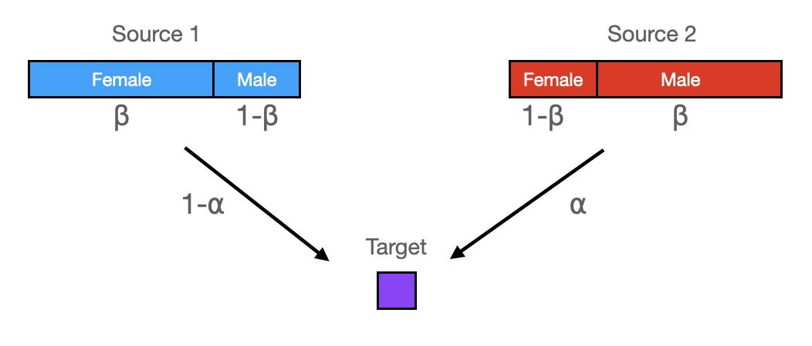

```{r include=FALSE}
library(magrittr)
library(ggplot2)
source("defs.R")
```

# Introduction

We would like to quantify sex biased admixture using uni-parental markers (Y chromosome- and mitochondrial haplotypes). We first will derive a simple calculation of the likelihood for whether a given haplotype was inherited from one group or another group, based on the sample counts of that haplogroup in the given source population. As we will see, this is rarely significant (i.e. most haplogroups could in principle have come from either group), so we turn towards estimating properties of an entire group, summarising across an entire admixture cline.

# Probability for source origin for individual haplogroups

Consider an admixed group of individuals, with two source components. Given a haplogroup (Y or MT) in a target individual, and the frequency of that haplogroup in both sources, we would like to compute the probability that a given haplogroup was contributed from Source 1 or Source 2.

Let us first assume that we know precisely the population haplogroup frequencies in both sources, denoted by $x_{ij}$ for haplogroup $i=1\ldots H$ in source $j=1,2$ (we use $\mathbf{x}$ to denote the set of $\{x_{ij}\}$. The likelihood for an individual to carry haplogroup $H=i$ contributed from source $S=j$ is then simply:

$$\mathcal{L}(H=i, S=j | \mathbf{x}) = x_{ij}$$
But the true population haplogroup frequencies are not known. Rather, we have a finite number of individuals in both sources. Specifically, we use $N_{ij}$ to denote the number of individuals with haplogroup $i$ in source $j$ (and $\mathbf{N}$ to denote the entire matrix). The unobserved population frequency is now a latent variable following a conditional distribution, $p(x | \mathbf{N})$, which - following standard Bayesian computaton - takes the form of a beta distribution with parameters $1 + N_{ij}$ and $1 + N_{.j} - N_{ij}$, where $N_{.j}=\sum_i N_{ij}$:

$$\mathcal{L}(x | \mathbf{N}) = \mathrm{Beta}(x | 1 + N_{ij}, 1 + N_{.j}-N_{ij})$$
which means that the full likelihood is a beta-binomial distribution with sample size 1, which can be written using beta functions:

$$\mathcal{L}(H=i, S=j | \mathbf{N}) = \int_0^1 x\, \mathrm{Beta}(x | 1 + N_{ij}, 1 + N_{.j}-N_{ij})\mathrm{d}x=\frac{B(2 + N_{ij}, 1 + N_{.j} - N_{ij})}{B(1 + N_{ij}, 1 + N_{.j} - N_{ij})}$$
We can now compute the probability $P(s|\mathbf{N}$ that a given target haplogroup was contributed from Source $s$ using Bayes rule:

\begin{equation}
\label{eq_ind_post_prob}
p(s|\mathbf{N})=\frac{\mathcal{L}(H=i, S=s | \mathbf{N})}{\sum_j \mathcal{L}(H=i, S=j | \mathbf{N})}
\end{equation}

or, in R code and for strictly two sources:

```{r}
source_likl <- function(n, N) {
  return(beta(2 + n, 1 + N - n) / beta(1 + n, 1 + N - n))
}
source_prob <- function(s, n1, N1, n2, N2) {
  prob1 <- source_likl(n1, N1)
  prob2 <- source_likl(n2, N2)
  if(s == 1) {
    return(prob1 / (prob1 + prob2))
  }
  else if(s == 2) {
    return(prob2 / (prob1 + prob2))
  }
  else
    stop("illegal source. s must be 1 or 2")
}
```


Next, we use this individual-based probability with Y chromosome haplogroups.

# Visualising Y haplogroup frequencies and CNE admixture proportions

```{r include=FALSE}
datj <- load_joint_table()
```

We consider data for `r nrow(datj)` individuals, grouped as follows:
```{r}
datj %>% dplyr::group_by(Population) %>% dplyr::summarise(n = dplyr::n())
```

We now declare three groups of samples. First, a group of admixed individuals from England_EMA, defined as individuals with CNE (continental North-European) admixture proportions between 2 and 98%:
```{r}
admixed_inds <- datj %>% dplyr::filter(ancientCNE > 0.02 & ancientCNE < 0.98)
```

and then two source groups: one consisting of individuals from Britain before the study period plus early medieval individuals with less than 2% CNE admixture (Source 1), and one consisting of individuals from Britain with more than 98% CNE ancestry and those sampled from across the North Sea (Source 2):
```{r}
source1_inds <- datj %>%
  dplyr::filter(Population %in% c("Britain_PreEMA", "England_PreEMA") | ancientCNE < 0.02)
source2_inds <- datj %>% dplyr::filter(ancientCNE > 0.98 | Population == "NorthSea_EMA")
```

We can now get the haplogroup frequencies in the two sources, and compute the probability of that haplogroup to come from source 2:
```{r}
source1_haps <- source1_inds %>%
  dplyr::group_by(HaplogroupY) %>%
  dplyr::summarise(n1 = dplyr::n())
N1 <- sum(source1_haps$n1)
source2_haps <- source2_inds %>%
  dplyr::group_by(HaplogroupY) %>%
  dplyr::summarise(n2 = dplyr::n())
N2 <- sum(source2_haps$n2)
source_haps <- dplyr::full_join(source1_haps, source2_haps, by="HaplogroupY") %>%
  tidyr::replace_na(list(n1 = 0, n2 = 0)) %>%
  dplyr::mutate(source2_prob = source_prob(2, n1, N1, n2, N2)) %>%
  dplyr::filter(!is.na(HaplogroupY))
source_haps
```

None of the probabilities is lower than 5% or higher than 95%, suggesting that none of these haplogroups is strictly indicative of male ancestry from a specific source. 

We may have more hope of viewing these probabilities for all admixed individuals as a function of their autosomal admixture proportion:

```{r}
admixed_inds_j <- admixed_inds %>%
  dplyr::left_join(source_haps, by="HaplogroupY") %>%
  tidyr::drop_na()
admixed_inds_j %>%
  ggplot() + geom_point(aes(ancientCNE, source2_prob)) + xlim(0, 1) + ylim(0, 1)
```

There is no obvious pattern to observe here, and we turn to more explicit modelling of sex bias

# Modelling Sex-bias

We set up a model with two parameters: The first parameter, $\alpha$, determines the amount of an individual's CNE ancestry (Source 2). The second parameter, $\beta$ determines the proportion of males within Source 2, with $1-\beta$ being the proportion of males within Source 1. Here is a schematic:



This leads to a simple calculation of male Source2-related ancestry over total male ancestry, $\gamma$:

$$
\gamma(\alpha, \beta) = \frac{\beta \alpha}{\beta \alpha + (1 - \beta) (1 - \alpha)}
$$

```{r}
male_adm_prop <- function(alpha, beta) {
  beta * alpha / (beta * alpha + (1 - beta) * (1 - alpha))
}
```

We can visualise this model as follows:

```{r}
tidyr::expand_grid(alpha = seq(0, 1, 0.01), beta = seq(0.1, 0.9, 0.1)) %>%
  dplyr::mutate(prop = male_adm_prop(alpha, beta)) %>%
  ggplot() +
    geom_line(aes(alpha, prop, col=beta, group = beta)) +
    xlim(c(0, 1)) + ylim(c(0, 1))
```
which shows that values of $\beta$ different from 0.5 can increase or decrease the male admixture proportion and deviate the curve from a model without sex-bias (a straight line). 

In order to estimate $\beta$ from the data, we our above derived individual-based likelihood model of a haplogroup coming from Source2. The likelihood for a single individual with haplogroup H and an autosomal admixture estimate $\alpha$ is

$$\mathcal{L}(H | \alpha, \beta, \mathbf{N}) = \gamma(\alpha, \beta) p(2|\mathbf{N}) + (1 - \gamma(\alpha, \beta))p(1 | \mathbf{N})$$
where we have used the individual-based posterior probability derived in equation \ref{eq_ind_post_prob}.

```{r}
likelihood_part <- function(alpha, beta, n1, N1, n2, N2) {
  male_adm_prop(alpha, beta) * source_prob(2, n1, N1, n2, N2) +
    (1 - male_adm_prop(alpha, beta)) * source_prob(1, n1, N1, n2, N2)
}
```

We can now compute the log-likelihood as a sum over all male admixed individuals

$$\log \mathcal{L}(\{H_k\}, \{\alpha_k\} | \beta, \mathbf{N}) = \sum_k \log p(H_k | \alpha_k, \beta, \mathbf{N})$$
where index $k$ runs over all individuals with haplotype $H_K$ and autosomal admixture estimate $\alpha_k$.

```{r}
log_likelihood <- function(data, beta, N1, N2, adm_column = "ancientCNE") {
  sum(log(likelihood_part(data[[adm_column]], beta, data$n1, N1, data$n2, N2)))
}
```

We can now compute the log likelihood of the data given various values of beta:
```{r}
tibble::tibble(beta = seq(0.1, 0.9, 0.1)) %>%
  dplyr::mutate(log_l = purrr::map_dbl(beta, ~ log_likelihood(admixed_inds_j, .x, N1, N2)))
```

which has its lowest value around 0.6, We can estimate the maximum numerically:

```{r}
optimize(function(beta) log_likelihood(admixed_inds_j, beta, N1, N2),
         c(0.01, 0.99), maximum = TRUE)
```

So indeed 0.64. We can plot that model together with our frequency-based estimates:

```{r}
model_plot_dat <- tibble::tibble(alpha=seq(0, 1, 0.01)) %>%
  dplyr::mutate(male_prop = male_adm_prop(alpha, 0.64))
admixed_inds_j %>%
  ggplot() + geom_point(aes(ancientCNE, source2_prob)) +
    geom_line(data = model_plot_dat, aes(x = alpha, y = male_prop)) +
    geom_abline(slope = 1, linetype="dashed") + xlim(0, 1) + ylim(0, 1)
```

So this would suggest a moderate male sex-bias in the CNE ancestry. But how significant is this? We can use our likelihood model to compute a posterior probability density over $\beta$:

$$p(\beta | \{H_k\}, \{\alpha_k\}, \mathbf{N}) = \frac{\mathcal{L}(\{H_k\}, \{\alpha_k\} | \beta, \mathbf{N})}
{\int_0^1 \mathcal{L}(\{H_k\}, \{\alpha_k\} | \beta, \mathbf{N})d\beta}$$

where the integral in the denominator can be approximated using a mesh over $\beta$, and we have implicitly taken a uniform prior for $\beta$ over the interval from 0 to 1:

```{r}
mesh <- tibble::tibble(
  beta = seq(0, 1, 0.01),
  likl = purrr::map_dbl(beta, ~ exp(log_likelihood(admixed_inds_j, .x, N1, N2)))
)
norm <- sum(mesh$likl)
mesh %>% dplyr::mutate(posterior = likl / norm) %>%
  ggplot() + geom_area(aes(x = beta, y = posterior), alpha = 0.7)
```

We can now see that the posterior distribution for $\beta$ comfortably includes the value $\beta=0.5$, which means that we cannot significantly reject a model of no sex-bias. Specifically, the 95% credibility interval includes values below and above 0.5, suggesting models of male as well as female sex-bias.

For completeness, we can perform the same calculation using a different estimate of autosomal admixture, using modern reference panels, yielding the following maximum likelihood model:

```{r}
optimize(function(beta) log_likelihood(admixed_inds_j, beta, N1, N2, adm_column = "modernCNE"),
         c(0.01, 0.99), maximum = TRUE)
```

```{r}
mesh <- tibble::tibble(
  beta = seq(0, 1, 0.01),
  likl = purrr::map_dbl(
    beta,
    ~ exp(log_likelihood(admixed_inds_j, .x, N1, N2, adm_column = "modernCNE"))
  )
)
norm <- sum(mesh$likl)
mesh %>% dplyr::mutate(posterior = likl / norm) %>%
  ggplot() + geom_area(aes(x = beta, y = posterior), alpha = 0.7)
```

which now is even leaning towards female sex-bias.

We conclude that the Y haplotype data is not conclusive with respect to sex bias. In particular, both using ancient and modern reference populations for estimating autosomal admixture proportions yield posterior distributions which comfortably include values below and above $\beta=0.5$ providing no clear evidence for either male or female sex-bias.

# Mitochondrial haplogroups

```{r}
source1_haps_mt <- source1_inds %>%
  dplyr::group_by(HaplogroupMT) %>%
  dplyr::summarise(n1 = dplyr::n())
N1 <- sum(source1_haps_mt$n1)
source2_haps_mt <- source2_inds %>%
  dplyr::group_by(HaplogroupMT) %>%
  dplyr::summarise(n2 = dplyr::n())
N2 <- sum(source2_haps_mt$n2)
source_haps_mt <- dplyr::full_join(source1_haps_mt, source2_haps_mt,
                                   by="HaplogroupMT") %>%
  tidyr::replace_na(list(n1 = 0, n2 = 0)) %>%
  dplyr::mutate(source2_prob = source_prob(2, n1, N1, n2, N2)) %>%
  dplyr::filter(!is.na(HaplogroupMT))
source_haps_mt
```

```{r}
admixed_inds_j <- admixed_inds %>%
  dplyr::left_join(source_haps_mt, by="HaplogroupMT") %>%
  tidyr::drop_na()
admixed_inds_j %>%
  ggplot() + geom_point(aes(ancientCNE, source2_prob)) + xlim(0, 1) + ylim(0, 1)
```
with all probabilities around 50%, the MT data conveys almost no information at all about source origin.

```{r}
tibble::tibble(beta = seq(0, 1, 0.1)) %>%
  dplyr::mutate(log_l = purrr::map_dbl(beta, ~ log_likelihood(admixed_inds_j, .x, N1, N2)))
```


```{r}
mesh <- tibble::tibble(
  beta = seq(0.01, 0.99, 0.01),
  likl = purrr::map_dbl(beta, ~ exp(log_likelihood(admixed_inds_j, .x, N1, N2)))
)
norm <- sum(mesh$likl)
mesh %>% dplyr::mutate(posterior = likl / norm) %>%
  ggplot() + geom_area(aes(x = beta, y = posterior), alpha = 0.7)
```

```{r}
mesh <- tibble::tibble(
  beta = seq(0.01, 0.99, 0.01),
  likl = purrr::map_dbl(
    beta,
    ~ exp(log_likelihood(admixed_inds_j, .x, N1, N2, adm_column = "modernCNE"))
  )
)
norm <- sum(mesh$likl)
mesh %>% dplyr::mutate(posterior = likl / norm) %>%
  ggplot() + geom_area(aes(x = beta, y = posterior), alpha = 0.7)
```