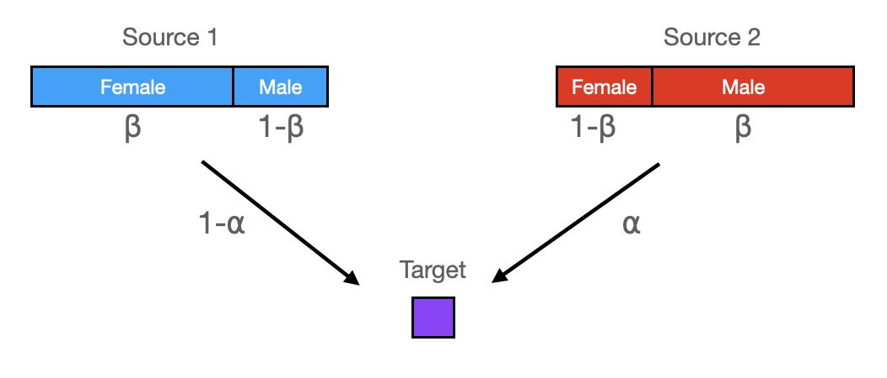

```{r include=FALSE}
library(magrittr)
library(ggplot2)
source("defs.R")
```

We would like to quantify potential sex bias in admixture using uni-parental markers (Y chromosome- and mitochondrial haplotypes). Specifically, we consider admixed early-medieval individuals from England, for which we have estimated CNE-WBI admixture proportions. We would like to use the observed uniparental markers in these individuals, and the frequency of these haplogroups in the putative source populations, to compare the likelihood of drawing a male (or female) CNE haplogroup with the autosomal admixture proportion. In the following, we denote WBI as source 1, and CNE as source 2.

We first will derive a simple calculation of the likelihood for whether a given haplotype was inherited from one group or another group, based on the sample counts of that haplogroup in the given source population. We first assume that we know precisely the population haplogroup frequencies in both sources, denoted by $x_{ij}$ for haplogroup $i=1\ldots H$ in source $j=1,2$ (we use $\mathbf{x}$ to denote the set of $\{x_{ij}\}$. The likelihood for an individual to carry haplogroup $H=i$ contributed from source $S=j$ is then simply:

$$\mathcal{L}(H=i, S=j | \mathbf{x}) = x_{ij}$$
But the true population haplogroup frequencies are not known. Rather, we have a finite number of individuals in both sources. Specifically, we use $N_{ij}$ to denote the number of individuals with haplogroup $i$ in source $j$ (and $\mathbf{N}$ to denote the entire matrix). The unobserved population frequency is now a latent variable following a conditional distribution, $p(x | \mathbf{N})$, which - following standard Bayesian computaton - takes the form of a beta distribution with parameters $1 + N_{ij}$ and $1 + N_{.j} - N_{ij}$, where $N_{.j}=\sum_i N_{ij}$:

$$\mathcal{L}(x | \mathbf{N}) = \mathrm{Beta}(x | 1 + N_{ij}, 1 + N_{.j}-N_{ij})$$
which means that the full likelihood is a beta-binomial distribution with sample size 1, which can be written using beta functions:

$$\mathcal{L}(H=i, S=j | \mathbf{N}) = \int_0^1 x\, \mathrm{Beta}(x | 1 + N_{ij}, 1 + N_{.j}-N_{ij})\mathrm{d}x=\frac{B(2 + N_{ij}, 1 + N_{.j} - N_{ij})}{B(1 + N_{ij}, 1 + N_{.j} - N_{ij})}$$
We can now compute the probability $P(s|\mathbf{N}$ that a given target haplogroup was contributed from Source $s$ using Bayes rule:

$$
p(s|\mathbf{N})=\frac{\mathcal{L}(H=i, S=s | \mathbf{N})}{\sum_j \mathcal{L}(H=i, S=j | \mathbf{N})}
$$

```{r include=FALSE}
source_likl <- function(n, N) {
  return(beta(2 + n, 1 + N - n) / beta(1 + n, 1 + N - n))
}
source_prob <- function(s, n1, N1, n2, N2) {
  prob1 <- source_likl(n1, N1)
  prob2 <- source_likl(n2, N2)
  if(s == 1) {
    return(prob1 / (prob1 + prob2))
  }
  else if(s == 2) {
    return(prob2 / (prob1 + prob2))
  }
  else
    stop("illegal source. s must be 1 or 2")
}
```


```{r include=FALSE}
datj <- load_data()
```

Here is a summary breakdown of the entire data into groups:
```{r}
datj %>% dplyr::group_by(Pop2) %>% dplyr::summarise(n = dplyr::n())
```

We now declare three groups of samples. First, a group of admixed individuals from England_EMA, defined as individuals with CNE (continental North-European) admixture proportions between 2 and 98%. Then two source groups: one consisting of individuals from Britain before the study period plus early medieval individuals with less than 2% CNE admixture (Source 1), and one consisting of individuals from Britain with more than 98% CNE ancestry and those sampled from across the North Sea (Source 2).

```{r include=FALSE}
admixed_inds <- datj %>% dplyr::filter(CNE > 0.02 & CNE < 0.98)
source1_inds <- datj %>%
  dplyr::filter(Pop2 %in% c("England_BA", "England_IA", "Ireland_BA",
                                  "Scotland_BA", "Scotland_IA", "Wales_BA",
                                  "Wales_IA") | CNE < 0.02)
source2_inds <- datj %>%
  dplyr::filter(CNE > 0.98 | Pop2 == "NorthSea_MA")
```

# Y chromosomes

We can now get the Y haplogroup frequencies in the two sources, and compute the probability of that haplogroup to come from source 2:
```{r echo=FALSE}
source1_haps <- source1_inds %>%
  dplyr::group_by(Y_1) %>%
  dplyr::summarise(n1 = dplyr::n())
N1 <- sum(source1_haps$n1)
source2_haps <- source2_inds %>%
  dplyr::group_by(Y_1) %>%
  dplyr::summarise(n2 = dplyr::n())
N2 <- sum(source2_haps$n2)
source_haps <- dplyr::full_join(source1_haps, source2_haps, by="Y_1") %>%
  tidyr::replace_na(list(n1 = 0, n2 = 0)) %>%
  dplyr::mutate(source2_prob = source_prob(2, n1, N1, n2, N2)) %>%
  dplyr::filter(!is.na(Y_1))
source_haps
```

None of the probabilities is lower than 5% or higher than 95%, suggesting that none of these haplogroups by themself is strictly indicative of male ancestry from a specific source. Nevertheless, we can view these probabilities as a function of autosomal admixture proportion:

```{r echo=FALSE}
admixed_inds_j <- admixed_inds %>%
  dplyr::left_join(source_haps, by="Y_1") %>%
  tidyr::drop_na()
admixed_inds_j %>%
  ggplot() + geom_point(aes(CNE, source2_prob)) + xlim(0, 1) + ylim(0, 1)
```

To understand this data, we set up a model with two parameters: The first parameter, $\alpha$, determines the amount of an individual's CNE ancestry (Source 2). The second parameter, $\beta$ determines the proportion of males within Source 2, with $1-\beta$ being the proportion of males within Source 1. Here is a schematic:



This leads to a simple calculation of male Source2-related ancestry over total male ancestry, $\gamma$:

$$
\gamma(\alpha, \beta) = \frac{\beta \alpha}{\beta \alpha + (1 - \beta) (1 - \alpha)}
$$

```{r include=FALSE}
male_adm_prop <- function(alpha, beta) {
  beta * alpha / (beta * alpha + (1 - beta) * (1 - alpha))
}
```

We can visualize this model as follows:

```{r echo=FALSE}
tidyr::expand_grid(alpha = seq(0, 1, 0.01), beta = seq(0.1, 0.9, 0.1)) %>%
  dplyr::mutate(prop = male_adm_prop(alpha, beta)) %>%
  ggplot() +
    geom_line(aes(alpha, prop, col=beta, group = beta)) +
    xlim(c(0, 1)) + ylim(c(0, 1))
```

which shows that values of $\beta$ different from 0.5 can increase or decrease the male admixture proportion and deviate the curve from a model without sex-bias (a straight line). 

In order to estimate $\beta$ from the data, we our above derived individual-based likelihood model of a haplogroup coming from Source2. The likelihood for a single individual with haplogroup H and an autosomal admixture estimate $\alpha$ is

$$\mathcal{L}(H | \alpha, \beta, \mathbf{N}) = \gamma(\alpha, \beta) p(2|\mathbf{N}) + (1 - \gamma(\alpha, \beta))p(1 | \mathbf{N})$$
where we have used the individual-based posterior probability derived in equation \ref{eq_ind_post_prob}.

```{r include=FALSE}
likelihood_part <- function(alpha, beta, n1, N1, n2, N2) {
  male_adm_prop(alpha, beta) * source_prob(2, n1, N1, n2, N2) +
    (1 - male_adm_prop(alpha, beta)) * source_prob(1, n1, N1, n2, N2)
}
```

We can now compute the log-likelihood as a sum over all male admixed individuals

$$\log \mathcal{L}(\{H_k\}, \{\alpha_k\} | \beta, \mathbf{N}) = \sum_k \log p(H_k | \alpha_k, \beta, \mathbf{N})$$
where index $k$ runs over all individuals with haplotype $H_K$ and autosomal admixture estimate $\alpha_k$.

```{r include=FALSE}
log_likelihood <- function(data, beta, N1, N2) {
  sum(log(likelihood_part(data$CNE, beta, data$n1, N1, data$n2, N2)))
}
```

We can estimate the maximum of that likelihood function under variation of $\beta$ numerically, and find

```{r echo=FALSE}
optimize(function(beta) log_likelihood(admixed_inds_j, beta, N1, N2),
         c(0.01, 0.99), maximum = TRUE)
```

We can plot that model together with our frequency-based estimates:

```{r echo=FALSE}
model_plot_dat <- tibble::tibble(alpha=seq(0, 1, 0.01)) %>%
  dplyr::mutate(male_prop = male_adm_prop(alpha, 0.64))
admixed_inds_j %>%
  ggplot() + geom_point(aes(CNE, source2_prob)) +
    geom_line(data = model_plot_dat, aes(x = alpha, y = male_prop)) +
    geom_abline(slope = 1, linetype="dashed") + xlim(0, 1) + ylim(0, 1)
```

So this would suggest a moderate male sex-bias in the CNE ancestry. But how significant is this? We can use our likelihood model to compute a posterior probability density over $\beta$:

$$p(\beta | \{H_k\}, \{\alpha_k\}, \mathbf{N}) = \frac{\mathcal{L}(\{H_k\}, \{\alpha_k\} | \beta, \mathbf{N})}
{\int_0^1 \mathcal{L}(\{H_k\}, \{\alpha_k\} | \beta, \mathbf{N})d\beta}$$

where the integral in the denominator can be approximated using a mesh over $\beta$, and we have implicitly taken a uniform prior for $\beta$ over the interval from 0 to 1:

```{r echo=FALSE}
mesh <- tibble::tibble(
  beta = seq(0, 1, 0.01),
  likl = purrr::map_dbl(beta, ~ exp(log_likelihood(admixed_inds_j, .x, N1, N2)))
)
norm <- sum(mesh$likl)
mesh %>% dplyr::mutate(posterior = likl / norm) %>%
  ggplot() + geom_area(aes(x = beta, y = posterior), alpha = 0.7)
```

We can now see that the posterior distribution for $\beta$ comfortably includes the value $\beta=0.5$, which means that the 95% credibility interval includes values below and above 0.5, suggesting models of male as well as female sex-bias being consistent with the data. We conclude that the Y haplotype data is not conclusive with respect to sex bias. 

# Mitochondrial haplogroups

We can apply the same methodology to mitochondrial haplotypes, with the main difference being the interpretation of $\gamma(\alpha, \beta)$ now describing the proportion of _female_ Source2 ancestry over total female ancestry.

We get a similar table of posterior probabilitites for every MT haplogroup coming from source 2:

```{r echo=FALSE}
mtCol <- "mtDNA_simple"
source1_haps_mt <- source1_inds %>%
  dplyr::group_by(.data[[mtCol]]) %>%
  dplyr::summarise(n1 = dplyr::n())
N1 <- sum(source1_haps_mt$n1)
source2_haps_mt <- source2_inds %>%
  dplyr::group_by(.data[[mtCol]]) %>%
  dplyr::summarise(n2 = dplyr::n())
N2 <- sum(source2_haps_mt$n2)
source_haps_mt <- dplyr::full_join(source1_haps_mt, source2_haps_mt,
                                   by=mtCol) %>%
  tidyr::replace_na(list(n1 = 0, n2 = 0)) %>%
  dplyr::mutate(source2_prob = source_prob(2, n1, N1, n2, N2)) %>%
  dplyr::filter(!is.na(.data[[mtCol]]))
source_haps_mt
```

which for our admixed individuals can be visualised again:
```{r echo=FALSE}
admixed_inds_j <- admixed_inds %>%
  dplyr::left_join(source_haps_mt, by=mtCol) %>%
  tidyr::drop_na()
admixed_inds_j %>%
  ggplot() + geom_point(aes(CNE, source2_prob)) + xlim(0, 1) + ylim(0, 1)
```

but with all probabilities around 50%, the MT data conveys almost no information at all about source origin, since haplogroup frequencies are too similar in the two source populations.

Indeed, the posterior distribution of $\beta$ in this case yields:
```{r echo=FALSE}
mesh <- tibble::tibble(
  beta = seq(0.01, 0.99, 0.01),
  likl = purrr::map_dbl(beta, ~ exp(log_likelihood(admixed_inds_j, .x, N1, N2)))
)
norm <- sum(mesh$likl)
mesh %>% dplyr::mutate(posterior = likl / norm) %>%
  ggplot() + geom_area(aes(x = beta, y = posterior), alpha = 0.7)
```

which is even broader than the already insignificant results from the Y chromosomal haplogroups, again showing that the data is consistent with models of both female and male sex-bias.

Note: The code used here can be found at https://github.com/stschiff/AngloSaxon_Y-chrom_sex-bias